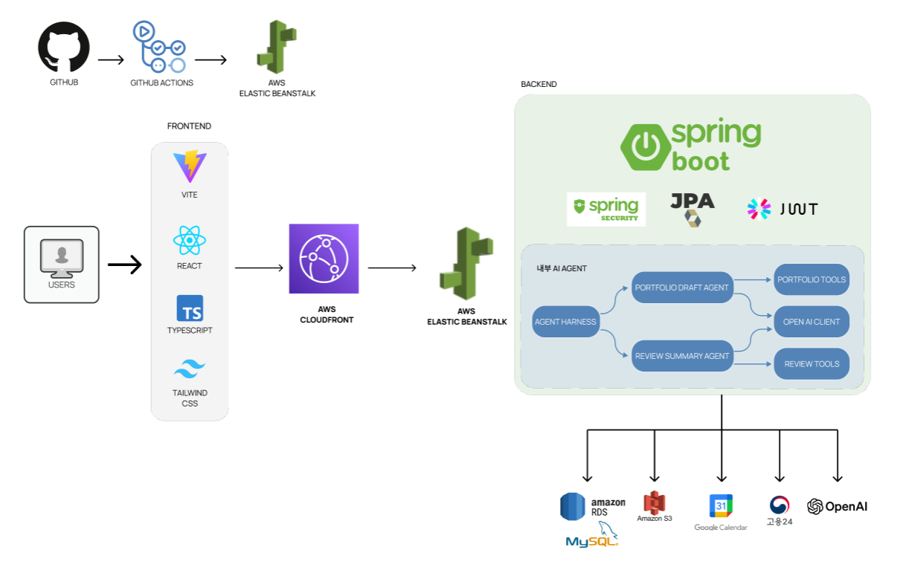

# BootSignal Backend

<div align="center">

**"나와 비슷한 사람이 이 과정에서 살아남았는가?"**

> 부트캠프 예비 수강생이 자신과 비슷한 조건의 사람들이  
> 실제로 과정을 완주했는지, 어떤 어려움을 겪었는지,  
> 수강 후 어떤 결과를 얻었는지 확인할 수 있도록 돕는  
> **데이터 기반 부트캠프 의사결정 플랫폼**

</div>

<br>

## 📖 목차

1. [🧑‍💻 팀 소개](#-팀-소개)
2. [💡 개발 배경](#-개발-배경)
3. [🧩 시스템 아키텍처](#-시스템-아키텍처)
4. [🚀 주요 기능](#-주요-기능)
5. [🛠️ 기술 스택](#️-기술-스택)
6. [⚙️ 로컬 실행](#️-로컬-실행)
7. [🐳 개발 인프라 실행](#-개발-인프라-실행)

<br>

## 🧑‍💻 팀 소개

| [](https://github.com/Paley-Z) | [](https://github.com/yongseong123) | [](https://github.com/2mhh) | [](https://github.com/hwangbohye03) | [](https://github.com/holly000) |
|:---:|:---:|:---:|:---:|:---:|
| <p align="center">이상민<br/>팀장 · 관리자</p> | <p align="center">최용성<br/>AI Agent · 인증</p> | <p align="center">이민홍<br/>데이터파이프라인 · 크롤링</p> | <p align="center">황보혜<br/>대시보드 · 캘린더</p> | <p align="center">나윤하<br/>커뮤니티 · 리뷰</p> |

<br>

## 💡 개발 배경

부트캠프 수강을 고민하는 사람들이 가장 많이 찾는 정보는 **"나와 비슷한 사람이 실제로 어떤 경험을 했는가"** 입니다.

기존 부트캠프 정보 서비스는 과정 목록, 커리큘럼, 후기 탐색에 집중하지만,  
막상 후기를 읽어도 **내 상황과 같은 사람의 이야기인지 알기 어렵습니다.**

> 비전공자인 나도 완주할 수 있을까?  
> 직장을 다니면서 병행할 수 있는 강도일까?  
> 수료 후 실제로 취업이 됐을까?

BootSignal은 **사용자 경험 데이터를 구조화**하여  
이러한 질문에 데이터로 답합니다.

- 조건별(비전공/전공, 직장 병행 여부 등) 통계와 수료율 제공
- 수강 인증 기반 신뢰도 높은 리뷰 시스템
- AI 리뷰 요약으로 방대한 후기를 빠르게 파악
- 수료생을 위한 AI 포트폴리오 초안 생성

<br>

## 🧩 시스템 아키텍처

<div align="center">
  
</div>

### 주요 아키텍처 특징

- **CI/CD 자동화** — GitHub Actions로 빌드·테스트 후 AWS Elastic Beanstalk에 자동 배포
- **내부 AI Agent** — Agent Harness가 Portfolio Draft Agent / Review Summary Agent를 조율하며, 각 Agent는 OpenAI API를 직접 호출하여 요약 및 초안을 생성
- **외부 데이터 수집** — 고용24 OpenAPI에서 과정 데이터를 Raw 테이블에 수집한 뒤 Course / Institution / CourseSession으로 정제
- **Google Calendar 연동** — 관심 과정 일정을 사용자의 Google Calendar에 직접 추가
- **파일 스토리지** — 수강 인증 자료 및 첨부 이미지는 AWS S3에 저장

프론트엔드 저장소: [prgrms-aibe-devcourse/AIBE5_FinalProject_Team5_FE](https://github.com/prgrms-aibe-devcourse/AIBE5_FinalProject_Team5_FE)

<br>

## 🚀 주요 기능

<details>
<summary><b>🔐 회원 / 인증</b></summary>

<br>

- 이메일 회원가입 / 로그인
- Google, Kakao OAuth2 소셜 로그인
- JWT Access Token + Refresh Token 발급 및 갱신
- 수강 증빙 파일 업로드 → 관리자 승인/반려 → 인증 리뷰 권한 부여
- 인증은 전역 Role이 아닌 **과정(courseId)별 승인 여부**로 판단

</details>

<details>
<summary><b>📚 과정 탐색 / 비교</b></summary>

<br>

- 고용24 OpenAPI 연동 과정 목록 · 상세 · 개강 일정 조회
- 최대 3개 과정 나란히 비교
- AI 과정 비교 요약 — 두 과정의 차이를 자연어로 요약
- Google Calendar 연동으로 관심 과정 일정 추가
- 과정 북마크

</details>

<details>
<summary><b>⭐ 리뷰 / 통계</b></summary>

<br>

- 일반 리뷰, 인증 리뷰 구분 작성
- 수강 중 / 수료 후 / 중도 포기 리뷰 구분
- 조건별 통계 (비전공/전공, 직장 병행 여부 등) 및 표본 수(N) 표시
- 표본 부족 과정은 데이터 부족 상태를 명확히 반환 (통계 과장 방지)
- AI 리뷰 요약 — 리뷰 전체를 요점 중심으로 자동 요약

</details>

<details>
<summary><b>🤖 AI 기능</b></summary>

<br>

- **AI 리뷰 요약** — 과정별 리뷰를 수집해 OpenAI API로 핵심 인사이트 압축
- **AI 과정 비교 요약** — 두 과정의 차이점을 OpenAI API로 자연어 비교
- **AI 포트폴리오 초안 생성** — 수료생의 프로젝트 경험 입력 시 OpenAI API로 포트폴리오 초안 자동 생성
- Spring Boot 내부에서 Agent Harness가 각 Agent를 조율하고, Agent가 OpenAI API를 직접 호출
- AI는 판단을 대신하지 않고, 내부 데이터 요약과 초안 생성을 **보조하는 역할**로만 사용

</details>

<details>
<summary><b>💬 커뮤니티</b></summary>

<br>

- 프로젝트 구인구직, QnA, 아티클, 자유 게시판
- 댓글, 대댓글
- 게시글 / 댓글 신고 및 관리자 처리

</details>

<details>
<summary><b>🛡️ 관리자</b></summary>

<br>

- 수강 인증 요청 목록 조회 · 승인 · 반려
- 고용24 데이터 수동 동기화
- 리뷰 · 게시글 · 댓글 신고 처리
- 관리자 대시보드: 인증 대기, 신고, 데이터 부족 과정, AI 사용량 요약

</details>

<br>

## 🛠️ 기술 스택

| 영역 | 기술 |
|---|---|
| Frontend | React, TypeScript, Vite, Tailwind CSS |
| Backend | Java 21, Spring Boot 3.5, Spring Web, Spring Data JPA |
| Auth | Spring Security, OAuth2 Client, JWT |
| Database | MySQL, H2 |
| File | AWS S3 SDK |
| AI | OpenAI API, 내부 Agent Harness (Portfolio Draft Agent, Review Summary Agent) |
| External API | 고용24 OpenAPI, Google Calendar API |
| Infra | Docker, Docker Compose, GitHub Actions, AWS Elastic Beanstalk, AWS CloudFront |
| Test | JUnit 5, Spring Boot Test, Spring Security Test |

<br>

## ⚙️ 로컬 실행

기본값으로 `local` 프로파일이 적용됩니다 (H2 인메모리 DB 사용).

**Windows**
```powershell
.\gradlew.bat bootRun
```

**macOS / Linux**
```bash
./gradlew bootRun
```

<br>

## 🐳 개발 인프라 실행

MySQL을 Docker로 먼저 실행합니다.

```bash
docker compose up -d mysql
```

`dev` 프로파일로 애플리케이션을 실행합니다.

**Windows**
```powershell
$env:SPRING_PROFILES_ACTIVE = "dev"
.\gradlew.bat bootRun
```

**macOS / Linux**
```bash
SPRING_PROFILES_ACTIVE=dev ./gradlew bootRun
```

### 프로파일 목록

| Profile | 용도 |
|---|---|
| `local` | H2 인메모리 DB 기본 실행 |
| `dev` | Docker Compose MySQL 사용 |
| `prod` | 운영 배포용, DB·외부 서비스를 환경 변수로 주입 |
| `test` | 테스트 전용 H2 인메모리 DB |

환경 변수 예시는 [.env.example](.env.example)을 참고하세요.

<br>

---

<div align="center">

_2026 프로그래머스 AIBE 5기 — Team 5_

</div>
