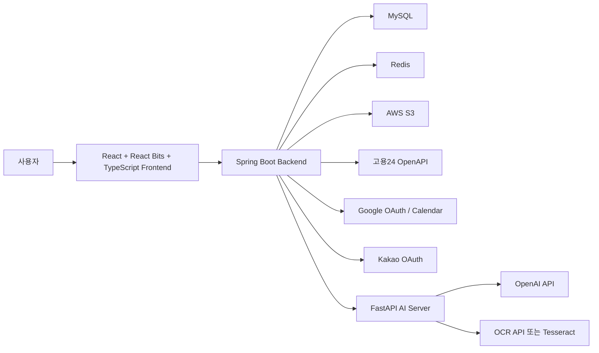

# BootSignal Backend

BootSignal은 부트캠프 예비 수강생이 자신과 비슷한 조건의 사람들이 실제로 과정을 완주했는지, 어떤 어려움을 겪었는지, 수강 후 어떤 결과를 얻었는지 확인할 수 있도록 돕는 데이터 기반 부트캠프 의사결정 플랫폼입니다.

이 저장소는 BootSignal의 메인 백엔드 API 서버입니다. 산출물 기준으로는 기획서, WBS v1.3, 주차별 WBS v1.2, API 명세 v1.3, ERD v1.2의 내용을 반영합니다.

## 핵심 가치

BootSignal이 답하려는 질문은 다음입니다.

> 나와 비슷한 사람이 이 과정에서 살아남았는가?

기존 부트캠프 정보 서비스는 과정 목록, 커리큘럼, 후기 탐색에 집중하지만, BootSignal은 사용자 경험 데이터를 구조화해 과정별 통계, 인증 리뷰, 조건별 비교, AI 보조 기능으로 제공합니다.

## 주요 사용자

| 사용자 | 제공 가치 |
| --- | --- |
| 비전공 예비 수강생 | 비전공자 기준 난이도, 진도 속도, 수료 가능성 확인 |
| 전공자 취준생 | 선수 지식 수준별 만족도와 프로젝트 성취도 확인 |
| 직장 병행 수강생 | 평균 자습 시간, 진도 속도, 수강 형태별 부담 확인 |
| 현재 수강생 | 수강 중 리뷰, QnA, 커뮤니티 참여 |
| 수료생 | AI 포트폴리오 초안 생성, 수료 후 리뷰 작성 |
| 관리자 | 수강 인증, 신고, 데이터 동기화, 운영 지표 관리 |

## MVP 범위

### P0: 발표 MVP 필수

- 이메일 회원가입/로그인, Google 로그인, Kakao 로그인, JWT 인증
- 고용24 OpenAPI 데이터 수집, Raw 저장, Course/Institution/CourseSession 정제
- 과정 목록, 과정 상세, 과정 세션 조회
- Google Calendar 연결 및 과정 일정 추가
- 수강 증빙 업로드, 관리자 승인/반려, 내 인증 상태 조회
- 일반 리뷰, 인증 리뷰, 수강 중/수료 후/중도 포기 리뷰 구분
- 조건별 통계, 표본 수 N, 데이터 부족 경고
- AI 리뷰 요약, AI 과정 비교 요약, AI 포트폴리오 초안 생성
- 최대 3개 과정 비교
- Docker, GitHub Actions, EC2, MySQL, S3 기반 배포 준비

### P1: 완성도 강화

- OCR 인증 판독 보조
- 커뮤니티: 프로젝트 구인구직, QnA, 아티클, 자유 게시판
- 과정 북마크
- 리뷰/게시글/댓글 신고 및 관리자 처리
- 관리자 대시보드: 인증 대기, 리뷰, 신고, 데이터 부족 과정, AI 사용량
- 정책 페이지: 개인정보, 이용약관, 리뷰 정책, 인증 자료 처리, 데이터 활용 동의, AI 사용 고지
- Redis 기반 통계/AI 결과 캐싱 및 사용량 제한

### P2: Post-MVP

- AI 상담
- OCR 기반 자동 인증 고도화
- 과정 비교 PDF 리포트
- 개인화 과정 추천
- 운영사 대시보드 SaaS, B2B 데이터 리포트
- 개발 외 교육 카테고리 확장

## 시스템 아키텍처



프론트엔드 저장소: [prgrms-aibe-devcourse/AIBE5_FinalProject_Team5_FE](https://github.com/prgrms-aibe-devcourse/AIBE5_FinalProject_Team5_FE)

## 기술 스택

| 영역 | 기술 |
| --- | --- |
| Frontend | React, React Bits, TypeScript |
| Backend | Java 21, Spring Boot 3.5.14, Spring Web, Spring Data JPA |
| Auth | Spring Security, OAuth2 Client, JWT |
| Database | MySQL, H2 |
| Cache | Redis |
| File | AWS S3 SDK |
| AI 연동 | OpenAI API, FastAPI AI 서버 연동 예정 |
| Infra | Docker, Docker Compose, GitHub Actions, EC2 |
| Test | JUnit 5, Spring Boot Test, Spring Security Test |

## 백엔드 설계 원칙

- 사용자 화면은 고용24 OpenAPI를 직접 호출하지 않고 BootSignal API만 호출합니다.
- 고용24 데이터는 Raw 테이블에 저장한 뒤 서비스용 Course, Institution, CourseSession으로 정제합니다.
- 고용24의 `TRPR_DEGR`는 사용자 표시 기수가 아니라 원본 회차값으로 저장합니다.
- 인증 리뷰 권한은 전역 Role이 아니라 `courseId`별 `APPROVED` 인증 여부로 판단합니다.
- 고용24 외부 통계와 BootSignal 내부 인증 리뷰 통계는 분리합니다.
- 표본 수가 부족한 과정은 통계를 과장하지 않고 데이터 부족 상태를 명확히 반환합니다.
- AI는 판단을 대신하지 않고 내부 데이터 요약, 비교, 포트폴리오 초안 생성을 보조합니다.
- OCR은 자동 승인용이 아니라 관리자 인증 검토 보조로만 사용합니다.

## 주요 API 범위

| 도메인 | Endpoint | 설명 | 우선순위 |
| --- | --- | --- | --- |
| Health | `GET /api/health` | Spring Boot 서버 상태 확인 | P0 |
| Auth | `POST /api/auth/signup` | 이메일 회원가입 | P0 |
| Auth | `POST /api/auth/login` | 이메일 로그인 및 JWT 발급 | P0 |
| Auth | `GET /api/auth/oauth/google` | Google 로그인 시작 | P0 |
| Auth | `GET /api/auth/oauth/kakao` | Kakao 로그인 시작 | P0 |
| User | `GET /api/users/me` | 내 정보 조회 | P0 |
| Course | `GET /api/courses` | 과정 목록 조회 | P0 |
| Course | `GET /api/courses/{courseId}` | 과정 상세 조회 | P0 |
| Course Session | `GET /api/courses/{courseId}/sessions` | 과정 개강 일정 조회 | P0 |
| Calendar | `GET /api/calendar/status` | Google Calendar 연결 상태 조회 | P0 |
| Calendar | `POST /api/calendar/events/course-session` | 과정 일정 캘린더 추가 | P0 |
| HRD Sync | `POST /api/admin/hrd/sync` | 고용24 데이터 수동 동기화 | P0 |
| Verification | `POST /api/verifications` | 수강 인증 신청 | P0 |
| Verification | `GET /api/verifications/me` | 내 인증 상태 조회 | P0 |
| Admin Verification | `GET /api/admin/verifications` | 인증 요청 목록 | P0 |
| Admin Verification | `PATCH /api/admin/verifications/{id}/approve` | 인증 승인 | P0 |
| Admin Verification | `PATCH /api/admin/verifications/{id}/reject` | 인증 반려 | P0 |
| Review | `POST /api/courses/{courseId}/reviews` | 일반/수강 중 리뷰 작성 | P0 |
| Review | `POST /api/courses/{courseId}/premium-reviews` | 인증 리뷰 작성 | P0 |
| Statistic | `GET /api/courses/{courseId}/statistics` | 조건별 통계 조회 | P0 |
| AI Summary | `GET /api/courses/{courseId}/ai-summary` | AI 리뷰 요약 조회 | P0 |
| Compare | `GET /api/courses/compare` | 최대 3개 과정 비교 | P0 |
| AI Compare | `POST /api/courses/compare/ai-summary` | AI 과정 비교 요약 | P0 |
| AI Portfolio | `POST /api/ai/portfolio-drafts` | AI 포트폴리오 초안 생성 | P0 |
| Community | `POST /api/posts`, `GET /api/posts` | 커뮤니티 게시글 작성/조회 | P1 |
| Bookmark | `POST /api/bookmarks/courses/{courseId}` | 과정 북마크 | P1 |
| Report | `POST /api/reports` | 리뷰/게시글/댓글 신고 | P1 |
| Admin Dashboard | `GET /api/admin/dashboard/summary` | 관리자 요약 지표 | P1 |

응답은 공통 `ApiResponse<T>` 형식을 기준으로 합니다.

```json
{
  "success": true,
  "code": "OK",
  "message": "요청이 성공했습니다.",
  "data": {}
}
```

## 주요 도메인 모델

| 영역 | 주요 테이블 |
| --- | --- |
| 사용자/인증 | `USER`, `OAUTH_ACCOUNT`, `GOOGLE_CALENDAR_TOKEN`, `CALENDAR_EVENT_LOG` |
| 고용24 Raw/Sync | `HRD_SYNC_LOG`, `HRD_COURSE_LIST_RAW`, `HRD_COURSE_DETAIL_RAW`, `HRD_TRAINING_SCHEDULE_RAW` |
| 과정 | `INSTITUTION`, `COURSE`, `COURSE_SESSION`, `EXTERNAL_REVIEW_SOURCE` |
| 수강 인증 | `VERIFICATION`, `OCR_RESULT` |
| 리뷰/통계 | `REVIEW`, `REVIEW_METRIC`, `COURSE_STATISTIC` |
| AI | `AI_SUMMARY`, `AI_SUMMARY_TARGET`, `AI_PORTFOLIO_DRAFT`, `AI_USAGE_LOG` |
| 커뮤니티/운영 | `POST`, `COMMENT`, `BOOKMARK`, `REPORT`, `ADMIN_AUDIT_LOG` |

## 프로파일

| Profile | 용도 |
| --- | --- |
| `local` | 기본 실행 프로파일입니다. H2 인메모리 DB를 사용합니다. |
| `dev` | Docker Compose로 실행한 MySQL, Redis를 사용합니다. |
| `prod` | 운영 배포용 프로파일입니다. DB, Redis, 외부 서비스 값을 환경 변수로 주입합니다. |
| `test` | 테스트 실행용 H2 인메모리 DB를 사용합니다. |

## 로컬 실행

기본값으로 `local` 프로파일이 적용됩니다.

Windows:

```powershell
.\gradlew.bat bootRun
```

macOS/Linux:

```bash
./gradlew bootRun
```

## 개발 인프라 실행

MySQL과 Redis를 Docker로 실행합니다.

```bash
docker compose up -d mysql redis
```

`dev` 프로파일로 애플리케이션을 실행합니다.

Windows PowerShell:

```powershell
$env:SPRING_PROFILES_ACTIVE = "dev"
.\gradlew.bat bootRun
```

macOS/Linux:

```bash
SPRING_PROFILES_ACTIVE=dev ./gradlew bootRun
```

## 테스트

Windows:

```powershell
.\gradlew.bat clean test
```

macOS/Linux:

```bash
./gradlew clean test
```

## 빌드

Windows:

```powershell
.\gradlew.bat clean build
```

macOS/Linux:

```bash
./gradlew clean build
```

## Docker 이미지 빌드

```bash
./gradlew clean build
docker build -t bootsignal-backend .
docker run --rm -p 8080:8080 bootsignal-backend
```

Windows에서는 첫 줄을 `.\gradlew.bat clean build`로 실행합니다.

## 환경 변수

환경 변수 예시는 [.env.example](.env.example)을 기준으로 확인합니다. 실제 `.env` 파일과 비밀 값은 Git에 커밋하지 않습니다.

| 변수 | 설명 |
| --- | --- |
| `SPRING_PROFILES_ACTIVE` | 활성 프로파일 |
| `SERVER_PORT` | 서버 포트 |
| `DB_URL` | MySQL JDBC URL |
| `DB_USERNAME` | DB 사용자 |
| `DB_PASSWORD` | DB 비밀번호 |
| `REDIS_HOST` | Redis 호스트 |
| `REDIS_PORT` | Redis 포트 |
| `JWT_ISSUER` | JWT 발급자 |
| `JWT_SECRET` | JWT 서명 키 |
| `JWT_ACCESS_TOKEN_VALIDITY_SECONDS` | Access Token 유효 시간 |
| `JWT_REFRESH_TOKEN_VALIDITY_SECONDS` | Refresh Token 유효 시간 |
| `CORS_ALLOWED_ORIGINS` | 허용 Origin 목록 |
| `AWS_REGION` | AWS 리전 |
| `AWS_S3_BUCKET` | S3 버킷 |
| `OPENAI_API_KEY` | OpenAI API Key |
| `OPENAI_MODEL` | OpenAI 모델명 |

## 현재 저장소 상태

현재 백엔드 저장소에는 Spring Boot 기반 실행 환경과 공통 설정이 구성되어 있습니다.

- Java 21, Spring Boot, Gradle Wrapper 설정
- Security, CORS, BCrypt `PasswordEncoder` 기본 설정
- JPA Auditing 설정
- H2, MySQL 프로파일 설정
- Redis 접속 설정
- AWS S3 Client Bean 설정
- OpenAI RestClient Bean 설정
- Dockerfile, Docker Compose 설정
- 기본 테스트 환경 설정

도메인 엔티티, 공통 응답/예외, 인증 API, 고용24 동기화, 과정/리뷰/통계/AI API 구현은 산출물 기준으로 순차 반영 예정입니다.
